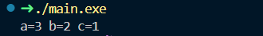

# stack 
栈就是CPU寄存器里的某个指针所指向的一篇内存区域
# push和pop
push 会对rsp寄存器的值进行减法、使之减去8，然后将操作数写到上述寄存器里的指针所指向的内存中
pop 逆操作、先从栈指针(rsp)指向的内存中读取数据、用以备用、然后将栈指针的数值加8
高地址
+-------------------+
|                   | <- 栈底 (高地址)
|                   |
|      ...          |
|                   |
|                   | <- rsp (栈顶，当前指向)
+-------------------+
低地址
# 栈的用途
1. 保存函数结束时的返回地址
   当程序使用call指令结束后的返回地址将被保存在栈里面、在call指向所调用的函数结束后、程序将
   执行无条件跳转指令、跳转到返回地址
   call=push 返回地址+jmp 函数地址
   被调用函数里的ret指令、会从栈中读取返回地址、然后跳转到这个地址
   ret= pop 返回地址+ jpm 返回地址 
2. 参数传递
   在x86平台的程序中、最常见的参数传递约定是cdecl。

3. 存储局部变量
   通过向栈底调整栈指针的方法、函数即可在数据栈里面分配出一片可用于存储局部变量的内存空间
# 栈的噪音
原有栈空间的局部数据不会被自动清除，它们就成了栈的噪音
```
void f1(){
    int a=1,b=2,c=3;
};
void f2(){
    int a,b,c;
    printf("a=%d b=%d c=%d\n",a,b,c);
};
int main(){
    f1();
    f2();
}                                                             
```
## 编译时
```shell
➜ cl main.c  
用于 x64 的 Microsoft (R) C/C++ 优化编译器 19.43.34810 版
版权所有(C) Microsoft Corporation。保留所有权利。
                                                                                           
main.c
F:\Users\26644\study-assembly\07-stack\main.c(6) : warning C4700: 使用了未初始化的局部变量“c”
F:\Users\26644\study-assembly\07-stack\main.c(6) : warning C4700: 使用了未初始化的局部变量“b”
F:\Users\26644\study-assembly\07-stack\main.c(6) : warning C4700: 使用了未初始化的局部变量“a”
Microsoft (R) Incremental Linker Version 14.43.34810.0                                     
Copyright (C) Microsoft Corporation.  All rights reserved.

/out:main.exe 
main.obj 
```
## 结果
```shell
➜ ./main.exe 
a=3 b=2 c=1
```

## 编译成asm
```
cl -S main.c /Famain.exe
```
# x86_64
x86：指基于 Intel 8086 处理器的 32 位指令集架构（ISA）
64：表示扩展到 64 位
x86-64 是 x86 架构的 64 位版本
# cdecl
## **什么是 `cdecl`？**
**`cdecl`**（C Declaration，C 语言调用约定）是一种 **函数调用约定**，规定了：
- 函数参数如何传递（通过栈还是寄存器）。
- 参数的压栈顺序。
- 栈清理的责任（调用者还是被调用者）。
- 寄存器保存规则。

`cdecl` 最初为 32 位 x86 架构设计，广泛用于 C 语言编译器（如 GCC、Microsoft C++）。在 x86-64 架构中，`cdecl` 的使用有所变化，特别是在 Windows 和 Linux 环境下。

---
```

# x86_64
x86：指基于 Intel 8086 处理器的 32 位指令集架构（ISA）
64：表示扩展到 64 位
x86-64 是 x86 架构的 64 位版本
# cdecl
## **什么是 `cdecl`？**
**`cdecl`**（C Declaration，C 语言调用约定）是一种 **函数调用约定**，规定了：
- 函数参数如何传递（通过栈还是寄存器）。
- 参数的压栈顺序。
- 栈清理的责任（调用者还是被调用者）。
- 寄存器保存规则。

`cdecl` 最初为 32 位 x86 架构设计，广泛用于 C 语言编译器（如 GCC、Microsoft C++）。在 x86-64 架构中，`cdecl` 的使用有所变化，特别是在 Windows 和 Linux 环境下。

---

## **`cdecl` 的核心规则（32 位 x86）**
在 **32 位 x86** 架构中，`cdecl` 的规则如下：
1. **参数传递**：
   - 所有参数通过 **栈** 传递。
   - 参数按 **从右到左** 的顺序压入栈（即最后一个参数最先压栈）。
   - 示例：对于函数 `func(a, b, c)`，栈上顺序为：
     ```
     高地址
     +-------------------+
     | c                 |
     | b                 |
     | a                 |
     +-------------------+
     低地址 (栈顶，esp 指向)
     ```
2. **栈清理**：
   - **调用者（Caller）** 负责清理栈。
   - 在函数返回后，调用者通过 `add esp, N`（`N` 为参数占用的字节数）恢复栈指针。
3. **返回地址**：
   - `call` 指令将返回地址压入栈。
   - 被调用者通过 `ret` 弹出返回地址。
4. **寄存器保存**：
   - **易失寄存器**（调用者保存）：`eax`, `ecx`, `edx`。
   - **非易失寄存器**（被调用者保存）：`ebx`, `esi`, `edi`, `ebp`。
5. **返回值**：
   - 整数或指针返回值放在 `eax`。
   - 浮点返回值通常使用 `st(0)`（FPU 栈顶）。

### **32 位 x86 示例（`cdecl`）**
假设调用 C 函数 `int add(int a, int b)`：
```c
int result = add(5, 10);
```
对应的 x86 汇编（`cdecl`）：
```nasm
; 调用者代码
push    10          ; 压入第二个参数 b
push    5           ; 压入第一个参数 a
call    add         ; 调用 add
add     esp, 8      ; 调用者清理栈（2 个参数，每个 4 字节）
mov     [result], eax ; 保存返回值

; add 函数
add:
    push    ebp
    mov     ebp, esp
    mov     eax, [ebp + 8]  ; 获取 a
    add     eax, [ebp + 12] ; 加 b
    mov     esp, ebp
    pop     ebp
    ret
```

- 参数 `a` 和 `b` 压栈（右到左）。
- 调用者清理栈（`add esp, 8`）。
- 返回值在 `eax`。

---

## **`cdecl` 在 x86-64 中的变化**
在 **x86-64** 架构中，`cdecl` 的使用因操作系统和调用约定而异：
1. **Linux/Unix (System V ABI)**：
   - x86-64 的 System V ABI 取代了传统的 `cdecl`，但保留了部分 `cdecl` 精神（如调用者清理栈）。
   - **参数传递**：
     - 前六个整数/指针参数通过寄存器：`rdi`, `rsi`, `rdx`, `rcx`, `r8`, `r9`。
     - 后续参数压栈（右到左）。
     - 前八个浮点参数使用 `xmm0-xmm7`。
   - **栈清理**：调用者负责清理栈上参数（类似 `cdecl`）。
   - **栈对齐**：调用函数前，栈必须 16 字节对齐。
   - **寄存器**：
     - 易失：`rax`, `rdi`, `rsi`, `rdx`, `rcx`, `r8`, `r9`, `r10`, `r11`, `xmm0-xmm15`。
     - 非易失：`rbx`, `rbp`, `r12`, `r13`, `r14`, `r15`。

   **示例（Linux x86-64）**：
   ```nasm
   ; 调用 add(5, 10)
   mov     rdi, 5      ; 第一个参数
   mov     rsi, 10     ; 第二个参数
   call    add
   ; 无需清理栈（参数通过寄存器）

   ; add 函数
   add:
       mov     rax, rdi
       add     rax, rsi
       ret
   ```

2. **Windows (Microsoft x64 Calling Convention)**：
   - Windows x86-64 不使用 `cdecl`，而是采用 **Microsoft x64 调用约定**，完全不同于 32 位 `cdecl`。
   - **参数传递**：
     - 前四个参数通过寄存器：`rcx`, `rdx`, `r8`, `r9`。
     - 后续参数压栈（右到左）。
     - 前四个浮点参数使用 `xmm0-xmm3`。
   - **影子空间**：
     - 调用者分配 32 字节影子空间（即使参数少于四个）。
   - **栈清理**：调用者清理栈上参数和影子空间。
   - **栈对齐**：16 字节对齐。
   - **寄存器**：
     - 易失：`rax`, `rcx`, `rdx`, `r8`, `r9`, `r10`, `r11`, `xmm0-xmm5`。
     - 非易失：`rbx`, `rbp`, `rdi`, `rsi`, `r12`, `r13`, `r14`, `r15`, `xmm6-xmm15`。

---


