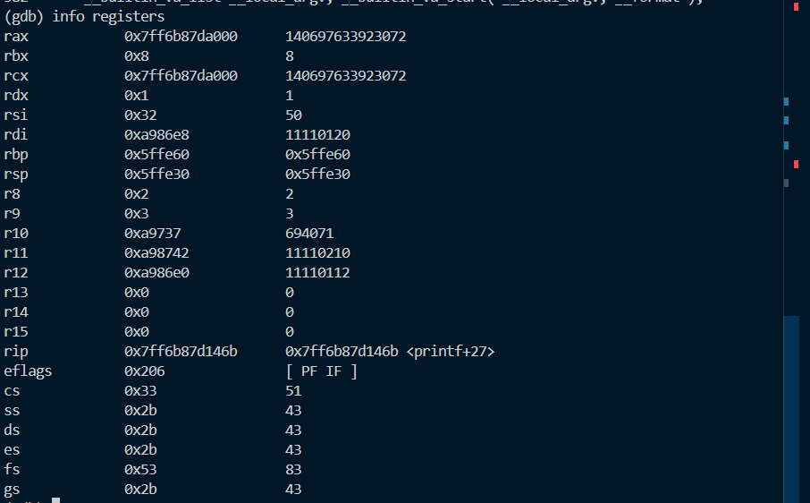
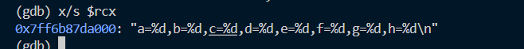

# 编译
```shell
gcc -g main.c -o main
```

# 调试

```
gdb main
```

## 设置断点

```shell
b printf
```

## 运行

```shell
run 
```

## 查看全部寄存器


```
info registers
```



rip中的地址`0x7ff6b87d146b`就是printf的首地址

## 检查格式化字符串

```shell
x/s $rcx
```




