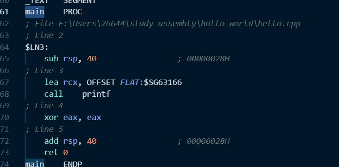

# 1. MSVC编译程序
```shell
cl hello.cpp
```
**结果如下**

# 2. 生成汇编指令
```shell
cl hello.cpp /Fahello.asm
```
**结果如下**

# 3 ai的解释
让我来解释这个汇编代码文件。这是一个简单的"Hello, World!"程序的汇编代码，由Microsoft编译器生成。我来详细解释主要部分：

1. 数据段定义：
```asm
CONST	SEGMENT
$SG63166 DB	'Hello, World!', 0aH, 00H
```
这里定义了字符串常量 "Hello, World!"，后面跟着换行符(0aH)和字符串结束符(00H)。

2. 主函数(main)：
```asm
main	PROC
    sub	rsp, 40					; 分配栈空间
    lea	rcx, OFFSET FLAT:$SG63166	; 加载字符串地址到rcx
    call	printf				; 调用printf函数
    xor	eax, eax				; 返回0
    add	rsp, 40					; 恢复栈指针
    ret	0
main	ENDP
```
这是程序的主函数，它：
- 分配了40字节的栈空间
- 将"Hello, World!"字符串的地址加载到rcx寄存器
- 调用printf函数打印字符串
- 返回0表示程序成功执行

3. printf函数实现：
```asm
printf	PROC
    mov	QWORD PTR [rsp+8], rcx		; 保存参数
    mov	QWORD PTR [rsp+16], rdx
    mov	QWORD PTR [rsp+24], r8
    mov	QWORD PTR [rsp+32], r9
    sub	rsp, 56				; 分配栈空间
    lea	rax, QWORD PTR _Format$[rsp+8]
    mov	QWORD PTR _ArgList$[rsp], rax
    mov	ecx, 1
    call	__acrt_iob_func		; 获取标准输出句柄
    call	_vfprintf_l		; 调用格式化输出函数
    add	rsp, 56				; 恢复栈指针
    ret	0
printf	ENDP
```
printf函数负责：
- 保存传入的参数
- 获取标准输出句柄
- 调用_vfprintf_l进行实际的格式化输出

4. 其他辅助函数：
- `_vfprintf_l`: 处理可变参数列表的格式化输出
- `__local_stdio_printf_options`: 获取printf的选项设置

这个程序展示了Windows x64平台下的基本汇编程序结构，包括：
- 函数调用约定（使用rcx, rdx, r8, r9传递前4个参数）
- 栈空间管理
- 标准库函数调用
- 字符串处理

这是一个典型的Windows平台下的Hello World程序，虽然看起来比简单的汇编程序复杂，但这是因为包含了完整的标准库支持。
# 总体的介绍
文件分为两个代码段
即CONST 段和_TEXT段
分别代码数据段和代码段
# main PROC是什么意思
- `main`是函数的名称
- `PROC`是"PROCEDURE"过程这个单词的缩写
完整的函数定义结构
```assembly
main PROC
    ; 函数体代码
    ret ; 函数返回
main ENDP ;函数返回
```
`ENDP`表示函数的结束
每个`PROC`必须有一个对应的ENDP
# 数据段
- `CONST`段：存放常量数据，如字符串常量
- `_BSS`段：存放未初始化的全局变量
- 数据段以`SEGMENT`开始，以`ENDS`结束
# 代码段
- `_TEXT`段：存放程序的可执行代码
- 包含所有函数的实现
- 同样以数据段以`SEGMENT`开始，以`ENDS`结束
# 其他常见段
- `.data`：已初始化的数据
- `.bss`： 未初始化的数据
- `.text`：程序代码
- `.rodata`：只读数据
# xor eax eax是什么意思
- xor是异或的意思
- eax是通用寄存器
- 合起来return 0的意思
# ret 0
- ret 是return的意思
- 在函数调用前，使用`sub rsp 40` 分配栈空间
- 在函数调用完成后，在返回之前，使用`add rsp 40`恢复栈空间
- `ret 0`表示不需要额外的栈调整
# rsp是什么
- rsp是Register Stack Pointer
- 是64位的寄存器
- 总是指向栈顶的位置（当前可用的最低内存地址，因为栈向低地址增长）
- 自动调整
   1. `PUSH`:rsp-=8
   2. `POP`:rsp+=8
   3. `CALL`:rsp-=8 并存入返回地址
   4. `RET`:rsp+=8 并跳回返回地址   
   